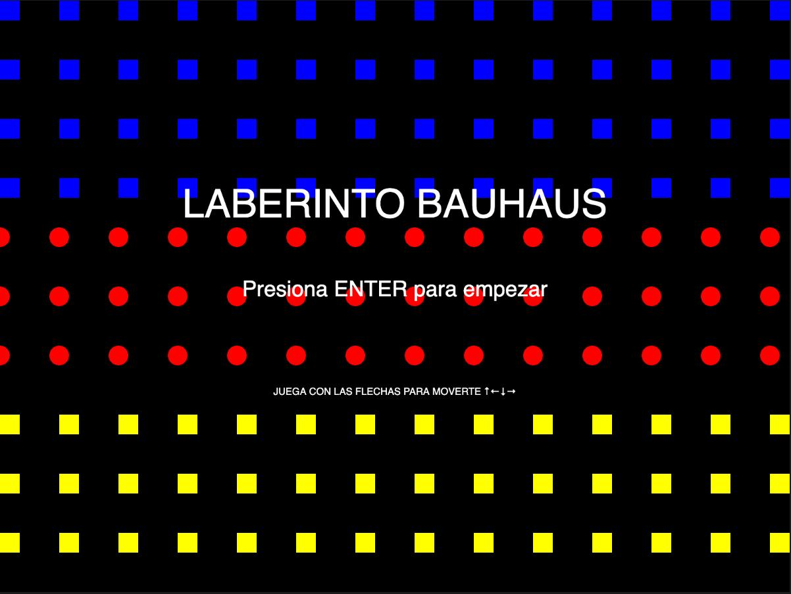
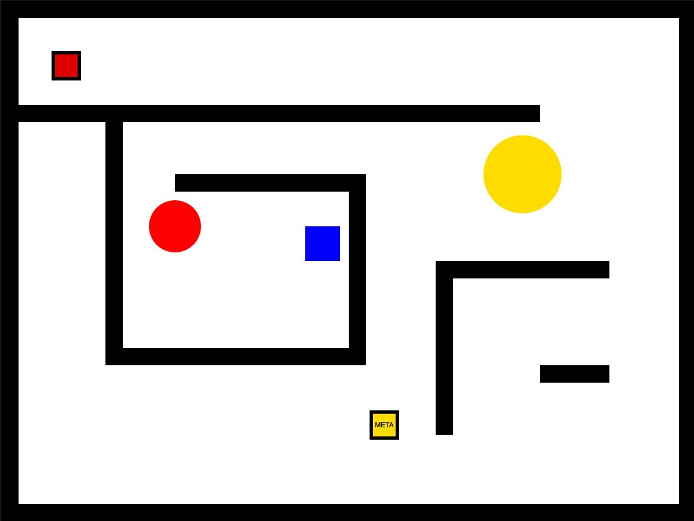

# EXAMEN-PENSAMIEN-COMPUTACIONAL
## Nombre del proyecto: Laberindo Bauhaus 

 

 

## Autor/a: Valentina Elizondo Pizarro
*Descripción objetiva*

**Descripción general** 
Este proyecto es un código de interacción con el usuario en formato de juego de laberinto, inspirado en la escuela de diseño Bauhaus. En este caso, el jugador utiliza la tecla ENTER para comenzar el juego.
Durante la partida, el jugador es representado por un cuadrado rojo, mientras que la meta es un cuadrado amarillo que cambia de posición cada vez que se inicia el juego. El jugador se mueve mediante las flechas del teclado con el objetivo de alcanzar esta meta.
Una vez que el jugador logra llegar a la meta, aparece una pantalla final donde se indica que se ha pasado el nivel 1 del juego.

**Qué es el proyecto** 
El proyecto consiste en un diseño interactivo con tres estados, inspirado en juegos de laberinto sencillos y en la estética visual de la escuela Bauhaus.
La interacción se realiza mediante el teclado. En el estado 0 se presenta la pantalla de inicio, donde al presionar la tecla ENTER se inicia el juego.
Una vez en la pantalla de juego, es decir el estado 1, el jugador puede moverse con las flechas del teclado. El objetivo es llegar a un cuadrado amarillo que contiene la palabra “META”. Cuando el jugador logra alcanzarlo, se completa el nivel.
Finalmente, se activa el estado 2, donde aparece una pantalla de victoria indicando que se ha pasado el nivel, junto con un sonido de música de victoria inspirado en los videojuegos.

**Qué se ve en pantalla** 
En la pantalla principal se presenta un lienzo de 800 × 600 píxeles, donde se organiza una composición de figuras geométricas planas con colores primarios, inspiradas en la escuela de diseño Bauhaus. Estas figuras están dispuestas en columnas y filas: en la parte superior se observan cuadrados azules, en la zona media círculos rojos y en la parte inferior cuadrados amarillos.
En el centro de la pantalla se incluyen distintos textos que dan la bienvenida al juego llamado “Laberinto Bauhaus”. Debajo de este título se presentan las instrucciones, indicando cómo comenzar (presionando la tecla ENTER) y cómo jugar utilizando las flechas del teclado para el desplazamiento del jugador.
En el segundo estado se visualiza el laberinto, el cual presenta una dificultad sencilla. Este está conformado por rectángulos negros organizados como un recorrido típico de laberinto. Además, se incorporan elementos circulares amarillos y rojos, junto con un cuadrado azul como elementos visuales decorativos. La paleta de colores y la composición general están inspiradas en la estética Bauhaus.
El jugador está representado por un cuadrado rojo con un contorno negro más grueso, mientras que la meta es un cuadrado amarillo con el mismo estilo de borde. Dentro de la meta se incluye el texto “META”, el cual facilita su identificación. El objetivo del jugador es alcanzar esta meta, moviéndose mediante las flechas del teclado. Durante este proceso se reproduce un sonido cada vez que se presiona una tecla, generando retroalimentación auditiva.
Finalmente, al completar el objetivo se activa una última pantalla donde se muestran columnas y filas de cuadrados azules en el lado derecho y cuadrados rojos en el lado izquierdo. En esta pantalla aparece un texto principal grande que indica “GANASTE”, y debajo un texto secundario que dice “pasaste de nivel”. Además, se reproduce una música de victoria característica de los videojuegos.

**Qué elementos visuales aparecen**
Los elementos visuales que aparecen durante los distintos estados del juego corresponden principalmente a figuras geométricas planas, como cuadrados y círculos, inspiradas en la estética Bauhaus. Estas figuras utilizan una paleta de colores primarios (rojo, amarillo y azul) y pueden variar según el estado del juego.
También se incorporan rectángulos negros que funcionan como los muros del laberinto, definiendo el recorrido y los límites del escenario.
En la pantalla de inicio y en la pantalla final se presentan textos centrados que cumplen diferentes funciones según el estado del juego, tales como instrucciones, mensajes de bienvenida o mensajes de celebración. Estos textos se muestran en color blanco para asegurar contraste y legibilidad. Finalmente, en la pantalla de victoria se utiliza una tipografía en estilo bold (negrita) para generar mayor jerarquía visual y reforzar el impacto del mensaje final.

**Qué inputs utiliza** 

ENTER: Sirve como input de confirmación para salir de la pantalla de inicio y empezar a jugar.

LEFT_ARROW (Flecha Izquierda): Input para mover al jugador hacia la izquierda y activar el sonido "tick".

RIGHT_ARROW (Flecha Derecha): Input para mover al jugador hacia la derecha y activar el sonido "tick".

UP_ARROW (Flecha Arriba): Input para mover al jugador hacia arriba y activar el sonido "tick".

DOWN_ARROW (Flecha Abajo): Input para mover al jugador hacia abajo y activar el sonido "tick".

mouseX: Mide la posición horizontal (de izquierda a derecha) del cursor. Lo usa en la pantalla final de dos maneras:
1. Cambiar el tamaño de las figuras (map).
2. Cambiar la forma y color: si pasa de la mitad de la pantalla, transforma los círculos rojos en cuadrados azules. 

**Qué outputs genera**
Lienzo : Un lienzo color negro de 800 x 600 píxeles (createCanvas(800, 600)

Pantalla de Inicio (estado == 0): Es el fondo y los textos que invitan a jugar.

El Juego (estado == 1): El laberinto donde el personaje (el cuadrado rojo) se mueve en tiempo real alcanzando la meta (el cuadrado amarillo) en una posición aleatoria.

Pantalla Final (estado == 2): "¡GANASTE!" Y la cuadrícula interactiva de figuras que cambian de tamaño y cambia entre círculos rojos y cuadrados azules cuando mueves el cursor.

Sonido: Cada vez que se presiona una flecha para mover al jugador, genera un audio (un "tick") para confirmarte que el personaje se movió, y al finalizar un sonido de victoria al pasar al ultimo estado.

Cambio de estado: Cuando presionas ENTER inicia el juego (estado = 1) donde al avanzar el jugador y alcanzar la meta genera un cambio (estado = 2)  y pasar a la pantalla de victoria.

Posición aleatoria: MetaX y metaY al inicial este juego se posiciona aleatoriamente cada vez que se inicia el juego

*Descripción conceptual*

**Idea central del proyecto**
La propuesta se inspira en mi entrega pasada, la cual se basaba en la estética de la escuela de diseño Bauhaus, retomando su paleta de colores primarios y el uso de figuras geométricas clásicas. Este nuevo proyecto continúa con ese concepto, pero modifica su forma de interacción con el usuario.
El proyecto se desarrolla a partir de la inspiración en juegos clásicos de laberintos sencillos, donde el jugador puede alcanzar rápidamente una meta. Para acercarlo a esta lógica de videojuego, se incorpora una pantalla de inicio con instrucciones sobre cómo jugar.
Durante el juego, el usuario interactúa en tiempo real mediante las flechas del teclado, con el objetivo de llegar a la meta. Cada movimiento del jugador genera un sonido tipo “tick”, que funciona como retroalimentación de desplazamiento.
Una vez que el jugador alcanza la meta, se muestra una pantalla de victoria acompañada de una música característica de los videojuegos, indicando que se ha completado el nivel 1 y que se podría avanzar a un nivel 2 con mayor dificultad. Esta última idea no se implementa en el proyecto actual, pero se considera como una posible extensión futura del desarrollo.

**Corriente o referente de diseño con el que dialoga**
El referente principal del proyecto es la escuela de diseño Bauhaus. La propuesta establece un diálogo con esta corriente a través del uso de su paleta de colores primarios y la aplicación de figuras geométricas básicas, como el círculo y el cuadrado.
Además, el proyecto también se inspira en videojuegos clásicos de laberintos sencillos, incorporando su lógica de recorrido y objetivo. 

**Listado y breve descripción de referentes visuales, teóricos o históricos**
El proyecto está inspirado en la escuela de diseño Bauhaus, tomando como base elementos característicos como el uso de colores primarios, formas geométricas y composiciones modulares. El principal referente visual corresponde a una obra con una composición inspirada en la estética de la Bauhaus, específicamente relacionada con el famoso cartel de la exposición Bauhaus de 1923 en Weimar, el cual actualmente se encuentra disponible como impresión decorativa en tiendas como NiceWall en Chile.

Además, el proyecto se inspira en videojuegos de laberintos sencillos para niños, como los que se encuentran en la página “juegosinfantilespum.com”, donde se presentan dinámicas simples de recorrido y resolución de laberintos, utilizando principalmente las teclas del computador y sin una alta complejidad en la interacción.

**Principio de diseño explorado**
El proyecto explora la composición modular inspirada en la Bauhaus, utilizando formas geométricas simples (cuadrados y círculos), colores primarios (rojo, azul, amarillo) y una organización en una grilla y laberinto. Estos elementos se integran en un laberinto de estructura simple. Además, la interactividad se incorpora mediante el desplazamiento del jugador con el teclado y una pantalla final en la que el tamaño y la forma de las figuras cambian según la posición del mouse, aportando dinamismo a la composición.

*Sistema computacional*

**Inputs**
Teclado: Tecla ENTER (para empezar) y las 4 flechas de dirección (LEFT_ARROW, RIGHT_ARROW, UP_ARROW, DOWN_ARROW) para mover al personaje.
Posición horizontal (mouseX): Captura un número entre 0 y 800 que indica la coordenada X del cursor y cambia los elementos geométricostricos tanto tamaño y color.

**Procesos**
-Asignación de posición aleatoria (nuevaMeta()): Se genera  números al azar random(50, 730) y random(50, 530). Donde genera números aleatorios guardándolos dentro de las variables metaX y metaY. Esto define las coordenadas exactas donde nacerá la meta(cuadrado amarillo).

-Bucles (for)
En la pantalla de inicio y en la pantalla final, el sistema utiliza dos bucles for para recorrer la pantalla formando una grilla. Los bucles comienzan en la posición 0 y avanzan de 60 en 60 píxeles hasta completar todo el lienzo, dibujando una figura en cada posición.

-Desplazamiento por cuadrícula (keyPressed):
Cada vez que el usuario presiona una flecha del teclado, el sistema modifica la posición del jugador en 30 píxeles. La flecha izquierda disminuye jugadorX, la derecha aumenta jugadorX, la flecha arriba disminuye jugadorY y la flecha abajo aumenta jugadorY. En cada movimiento también se reproduce el sonido tick.mp3. 

-Detección de la Meta (dist):
El sistema calcula constantemente la distancia entre la posición del jugador y la posición de la meta utilizando la función dist(). Si la distancia es menor a 20 píxeles, el programa considera que el jugador llegó a la meta y cambia el estado del juego a la pantalla final(estado 2).

-Regla de Proporción (map)
En la pantalla final, el sistema toma el input mouseX (que va de 0 a 800) y lo cambia a un nuevo tamaño entre 10 y 50 píxeles. Como resultado, mientras más a la izquierda esté el mouse, más pequeñas serán las figuras; mientras más a la derecha esté, más grandes serán.

-Regla de Condicionales (if / else if / else)
Pantalla inicio:
-Si Y es menor a 200 píxeles (y < 200) → El sistema dibuja un cuadrado azul (0, 0, 255) en cada posición de la grilla.
-Si Y es mayor o igual a 200 y menor a 400 píxeles (y < 400) → El sistema dibuja un círculo rojo (255, 0, 0).
-Si Y es mayor o igual a 400 píxeles → El sistema dibuja un cuadrado amarillo (255, 255, 0).

En la pantalla final:

-Si mouseX es mayor que la mitad de la pantalla → Se dibujan cuadrados azules.

-Si no → Se dibujan círculos rojos.

-Regla de Reproducción de Sonidos
El sistema reproduce tick.mp3 cada vez que el jugador se mueve con las flechas. Cuando el jugador llega a la meta y entra a la pantalla final, verifica si victoria.mp3 ya está sonando.

**Estados**
El proyecto funciona mediante 2 estados

-Estado 0 (Pantalla de Inicio): Corresponde a la pantalla inicial del proyecto. El sistema muestra el título, las instrucciones y una composición de figuras inspiradas en la Bauhaus. Permanece en este estado hasta que el usuario presiona la tecla ENTER.
-Estado 1 (Juego): Se activa cuando el usuario presiona ENTER. En este estado el sistema dibuja el laberinto, la meta y el jugador, este se mueve presionando las flechas del teclado con un sonido de tick y una vez cerca de la meta se cambia al siguiente estado.
-Estado 2 (Pantalla Final): Se activa automáticamente cuando la distancia entre el jugador y la meta es menor a 20 píxeles. El sistema muestra la pantalla de victoria, reproduce el sonido de victoria y permite interactuar con la composición final mediante el movimiento horizontal del mouse.

**Eventos**
-Evento: Presionar ENTER
Cuando el usuario presiona la tecla ENTER, el sistema cambia el valor de estado de 0 a 1, reemplazando la pantalla de inicio por el juego.
-Evento: Presionar  flechas del teclado
Cada vez que el usuario presiona una de las flechas (↑ ↓ ← →), el sistema actualiza la posición del jugador desplazándolo 30 píxeles en la dirección correspondiente y reproduce el sonido de tick.
-Evento: Alcanzar la meta
Cuando el sistema detecta que la distancia entre el jugador y la meta es menor a 20 píxeles mediante la función dist(), cambia automáticamente el valor de estado de 1 a 2, finalizando el juego.
-Evento: Mover el mouse en la pantalla final
Una vez alcanzada la victoria, el movimiento horizontal del mouse modifica continuamente el tamaño de las figuras mediante la función map(). 

**Outputs**
-Laberinto:
Durante el juego, el sistema dibuja un fondo blanco con un marco negro alrededor del lienzo. En el interior se generan muros rectangulares negros con distintas dimensiones que forman el recorrido del laberinto. Además, se dibujan figuras inspiradas en la Bauhaus ubicados en posiciones fijas dentro del escenario.

-Regla del Jugador y la Meta:
El jugador se representa como un cuadrado rojo de 30 × 30 píxeles, cuya posición cambia según las flechas del teclado. La meta se representa como un cuadrado amarillo de 30 × 30 píxeles, ubicado en una posición aleatoria del lienzo, con el texto "META" centrado en su interior para identificarla.

-Regla de la Pantalla Final:
Al llegar a la meta, el sistema reemplaza el laberinto por un fondo negro donde se dibuja una grilla de figuras separadas cada 60 píxeles. Si el cursor está en la mitad izquierda del lienzo, la grilla está formada por círculos rojos; si el cursor se mueve a la mitad derecha, las figuras cambian a cuadrados azules. El tamaño de todas las figuras varía entre 10 y 50 píxeles según la posición del mouse horizontal.

-Regla de los Textos:
El sistema muestra distintos textos según el estado del juego. En la pantalla de inicio aparecen el título "LABERINTO BAUHAUS", la instrucción "Presiona ENTER para empezar" y una guía para utilizar las flechas del teclado. En la pantalla final se muestran los mensajes "¡GANASTE!" y "PASASTE EL NIVEL 1", centrados en el lienzo, en color blanco y con el texto principal en estilo Bold.

-Regla de los Sonidos:
Cada vez que el jugador realiza un movimiento con las flechas del teclado, el sistema reproduce el sonido tick.mp3 en cada presión. Al alcanzar la meta y cambiar a la pantalla final, se reproduce victoria.mp3, indicando que el nivel ha sido completado.

**Explicación del sistema de interactividad**
El sistema de interactividad del proyecto se basa principalmente en la utilización del teclado y, en la pantalla final, la posición horizontal del mouse. Durante el juego, el usuario controla el desplazamiento del jugador mediante las flechas del teclado, permitiéndole recorrer el laberinto hasta encontrar la meta. El sistema actualiza continuamente la posición del jugador y calcula la distancia entre este y la meta para detectar cuándo se alcanza el objetivo. Una vez completado el recorrido, el programa cambia automáticamente a la pantalla final, donde el movimiento horizontal del mouse modifica dinámicamente el tamaño de las figuras en el fondo. Todo este comportamiento se esta dentro de draw(), permitiendo una interacción visual en tiempo real. 

**Qué datos entran**
-Teclas del teclado (ENTER): Cambia el estado del programa desde la pantalla de inicio al juego.
-Flechas del teclado (↑ ↓ ← →): Modifican la posición del jugador desplazándolo 30 píxeles en cada pulsación.
-MouseX (Coordenada X del cursor): En la pantalla final registra el movimiento horizontal del mouse. Este valor controla el tamaño de las figuras mediante la función map() y también determina si se dibujan círculos rojos o cuadrados azules.
-Valor aleatorio (random): Al comenzar la partida, la función random() genera las coordenadas metaX y metaY, ubicando la meta en una posición diferente dentro del lienzo en cada ejecución.

**Cómo se procesan y transforman**
Los datos son procesados durante toda la ejecución del programa. Primero, el sistema inicia con la tecla ENTER para actualizar la posición del jugador dentro del laberinto y la meta en su posición aleatoria. Después en cada movimiento, calcula la distancia entre el jugador y la meta mediante la función dist(). Cuando esta distancia es menor a 20 píxeles, el sistema cambia el estado del juego y muestra la pantalla final. Cuando el usuario mueve el mouse en la pantalla de victoria, la función map() transforma el valor horizontal de mouseX en tamaños entre 10 y 50 píxeles. Además, (if / else) interpretan si el cursor se encuentra a la izquierda o a la derecha del centro del lienzo para decidir si la composición se dibuja con círculos rojos o cuadrados azules. 

**Qué respuesta visual producen**
El sistema responde mostrando diferentes estados según la interacción del usuario. Inicialmente presenta una pantalla de inicio con instrucciones para comenzar el juego. Durante la partida, el jugador se desplaza visualmente por el laberinto mediante las flechas del teclado, mientras la meta permanece visible en una posición aleatoria. Cada movimiento reproduce un sonido de tick. Cuando el jugador alcanza la meta, el sistema cambia automáticamente a una pantalla de victoria donde aparecen los mensajes "¡GANASTE!" y "PASASTE EL NIVEL 1", se reproduce un sonido de victoria y la composición cambia dinámicamente según la posición del mouse, modificando el tamaño y el tipo de figuras. 

**Recursos multimedia utilizados**
Se utiliza como recurso multimedia la musica, que aparece 2 tipos de musica y en diferentes estados, en la pantalla de jugar se presenta un sonido de tick cada vez que el jugador se desplaza por el laberinto y llegando a la meta y visualizando el ultimo estado se escucha un sonido de victoria representando que pasaste de nivel y que ganaste. Esto se utilizo principalmente para acercarse mas a los videojuegos. 

**Principales decisiones tomadas**
Principalmente, al inicio no me gustaba mi proyecto de la solemne anterior y me incomodaba trabajar con él para este examen. Por eso, después de pensarlo bastante, decidí crear un nuevo proyecto desde cero, donde la interactividad pudiera verse más limpia y visualmente más atractiva.
Desde el comienzo pensé en hacer un juego, pero entre las distintas ideas opté por un laberinto sencillo, típico de la niñez, reutilizando el concepto de la escuela de diseño “Bauhaus”.
En un inicio quería hacer un juego más largo, con distintos estados y música, pero tuve que replantearlo considerando el tiempo disponible para realizar el proyecto.
También decidí utilizar las flechas del teclado como método de movimiento, ya que en mi niñez no podía utilizar las letras para jugar y siempre usaba las flechas, por lo que me pareció coherente mantener ese tipo de control en el juego.

**Dificultades encontradas**
Tuve varias dificultades porque no entendía bien cómo juntar todos los códigos entregados para este examen. Como empecé desde cero, tuve que pensar y repasar los códigos constantemente, ya que se me olvidaban cómo funcionaban o qué hacía cada parte.
Organicé todo mi código a partir de ejemplos vistos en clases, también con ayuda de amigos que tienen más experiencia en este programa, y recurrí a la inteligencia artificial para poder entender mejor el funcionamiento del código, principalmente en cómo y dónde colocar la música correctamente.
Este trabajo fue más bien un proceso de prueba y error constante, ajustando posiciones, números, tamaños y comportamientos hasta lograr la idea principal del proyecto y quedar satisfecha con el resultado final.

**Aprendizajes obtenidos**
Si no estás satisfecho con una entrega anterior y debes reutilizarla como opción, es importante que no gane la flojera, sino que te atrevas a hacer un nuevo proyecto que realmente te satisfaga y con el que quedes conforme. No importa cuánto tiempo te tome, lo importante es el resultado final y tu satisfacción con el trabajo.

